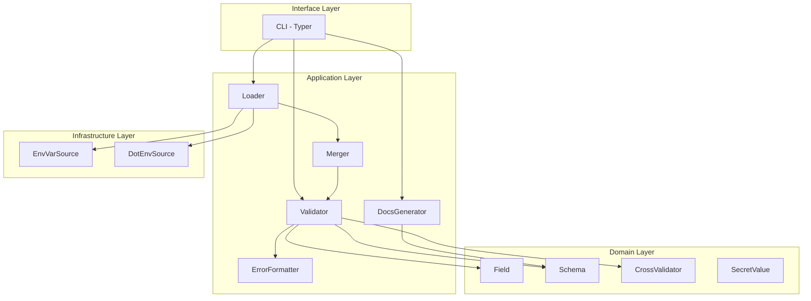

# Arquitetura — config-validator

## Visão geral

`config-validator` segue uma arquitetura em 4 camadas (inspirada em Clean
Architecture), onde as dependências apontam sempre para dentro — o Domain
não conhece nada além de si mesmo:

## Status de implementação

| Camada | Status | Componentes prontos |
|---|---|---|
| **Domain** | ✅ Completo (M1) | `Field`, `Schema`, `CrossValidator`, `SecretValue` |
| **Application** | ⏳ Não iniciado (M2/M3) | `Loader`, `Merger`, `Validator`, `ErrorFormatter`, `DocsGenerator` |
| **Infrastructure** | ⏳ Não iniciado (M2) | `EnvVarSource`, `DotEnvSource` |
| **Interface (CLI)** | ⏳ Não iniciado (M4) | `config-validator check`, `config-validator docs` |

## Decisões arquiteturais (ADRs)

Ver `docs/adr/` para o detalhamento completo de cada decisão. Resumo:

- **ADR-001**: Pydantic v2 como motor de validação (não reimplementar parsing de tipos).
- **ADR-002**: `ConfigSource` como interface — extensível sem modificar o `Loader` (Open/Closed).
- **ADR-003**: objeto de configuração final é imutável (frozen) após validação.
- **ADR-004**: erros de validação são agregados, não fail-fast no primeiro campo.

## Débitos técnicos e responsabilidades pendentes

> Esta seção existe para que decisões adiadas conscientemente não se
> percam entre uma issue e outra. Cada item aqui deve ser resolvido ou
> reavaliado explicitamente quando o milestone correspondente for aberto.

### 1. `SecretValue` protege o `default` do `Field`, mas ainda não o valor resolvido em runtime

**Status:** parcialmente resolvido (Issue #4, M1).

O que já funciona: quando um `Field(secret=True)` tem um `default`, esse
`default` é automaticamente envolvido em `SecretValue` — o `repr()` do
próprio `Field` não vaza mais o valor.

O que **ainda não** funciona: quando o valor de um campo secreto vem de
uma fonte real (env var ou `.env`), o `Loader`/`Validator` (Application
layer, ainda não implementados) precisam envolver esse valor resolvido em
`SecretValue` também, antes de expô-lo no objeto de configuração final.
Sem isso, `config.api_key` devolveria uma `str` crua, e qualquer
`logger.info(f"Config: {config}")` no código do usuário da lib vazaria a
env var real — o cenário exato que `SecretValue` foi criado para evitar.

**Ação pendente:** ao implementar o `Validator` (Issue #7, M3), garantir
que todo campo com `field.secret is True` tenha seu valor final envolvido
em `SecretValue` antes de ser atribuído ao objeto de configuração —
independentemente de ter vindo de `default`, env var ou `.env`. Adicionar
teste de integração explícito para este caso (não só testes unitários do
`SecretValue` isolado).

### 2. `Schema.namespace_tree` retorna `dict` cru, não uma classe tipada

**Status:** decisão adiada deliberadamente (Issue #2, M1).

Ver ADR correspondente a ser criado se a dor aparecer durante a
implementação do `Validator` (M3), quando ele precisar percorrer a árvore
para montar o objeto de configuração final aninhado.
