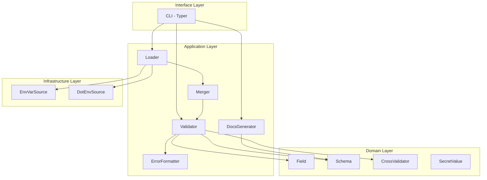

# Arquitetura — config-validator

## Visão geral

`config-validator` segue uma arquitetura em 4 camadas (inspirada em Clean
Architecture), onde as dependências apontam sempre para dentro — o Domain
não conhece nada além de si mesmo:

## Status de implementação

| Camada | Status | Componentes prontos |
|---|---|---|
| **Domain** | ✅ Completo (M1) | `Field`, `Schema`, `CrossValidator`, `SecretValue` |
| **Application** | ✅ Completo (M2/M3) | `Loader`, `ConfigSource`, `Validator`, `ErrorFormatter`, `ConfigBuilder` |
| **Infrastructure** | ✅ Completo (M2) | `EnvVarSource`, `DotEnvSource` |
| **Interface (CLI)** | ✅ Completo (M4) | `config-validator check`, `config-validator docs` |

## Decisões arquiteturais (ADRs)

Ver `docs/adr/` para o detalhamento completo de cada decisão. Resumo:

- **ADR-001**: Pydantic v2 como motor de validação (não reimplementar parsing de tipos).
- **ADR-002**: `ConfigSource` como interface — extensível sem modificar o `Loader` (Open/Closed).
- **ADR-003**: objeto de configuração final é imutável (frozen) após validação.
- **ADR-004**: erros de validação são agregados, não fail-fast no primeiro campo.

## Débitos técnicos e responsabilidades pendentes

> Esta seção existe para que decisões adiadas conscientemente não se
> percam entre uma issue e outra. Cada item aqui deve ser resolvido ou
> reavaliado explicitamente quando o milestone correspondente for aberto.

### 1. `SecretValue` protege o `default` do `Field` e o valor resolvido em runtime

**Status:** ✅ resolvido (Issue #4, M1 + Issue #7, M3).

Quando um `Field(secret=True)` tem um `default`, esse `default` é
automaticamente envolvido em `SecretValue` desde a Issue #4 — o `repr()`
do próprio `Field` não vaza o valor.

Desde a Issue #7, o `Validator` também envolve em `SecretValue` o valor
final *resolvido* (vindo de env var, `.env`, ou do próprio default),
antes de devolvê-lo no dict de configuração — e o `ConfigBuilder`
(Issue #8) preserva esse mascaramento em toda a árvore aninhada de
`ConfigNamespace`. Coberto por testes de integração ponta a ponta em
`test_validator.py` (`TestValidatorSecretWrapping`) e
`test_config_builder.py` (`test_secret_field_masked_in_repr_through_the_full_tree`).

### 2. `Schema.namespace_tree` retorna `dict` cru, não uma classe tipada

**Status:** decisão adiada deliberadamente (Issue #2, M1) — ainda válida.

O `ConfigBuilder` (Issue #8) já percorre essa árvore com sucesso usando
`isinstance(node, Field)` para diferenciar folha de sub-namespace. Não
apareceu dor real o suficiente para justificar uma classe `NamespaceNode`
tipada até agora — mantido como está.

### 3. `docs` só suporta `--format table` e `--format json`

**Status:** registrado como roadmap futuro (Issue #10, M4).

`--format markdown` seria útil para colar a documentação de configuração
direto em um README de projeto, sem reformatação manual. Não implementado
ainda porque não fazia parte do escopo original da RF06, mas a lógica de
formatação já está isolada (`_print_table` / `json.dumps`), então
adicionar um terceiro branch de formato é uma extensão barata quando for
priorizado — provável candidato para o M5 (Docs, Packaging & Release),
já que nesse ponto o próprio README principal do projeto estará sendo
escrito.
